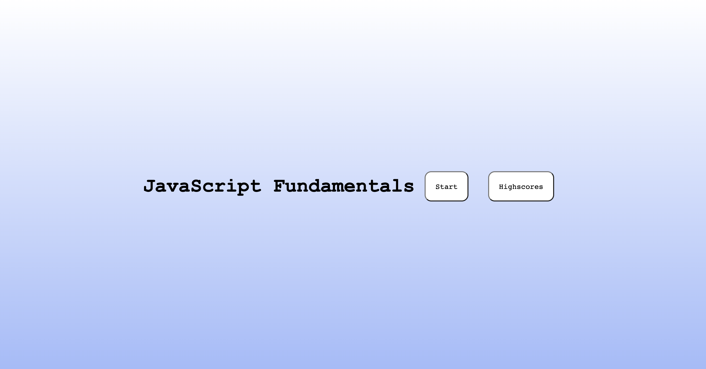
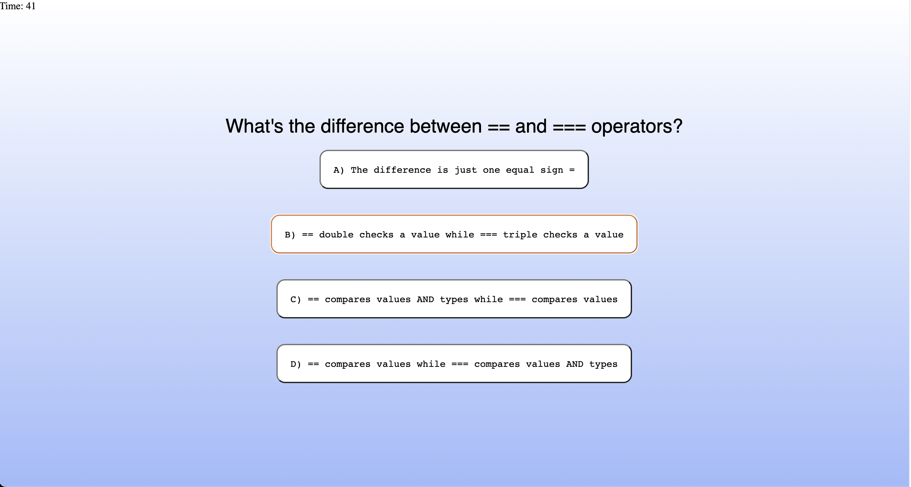

# Technical-Code-Quiz 


## **Description**
- This technical quiz is made to give you, the user, practice reviewing several technical coding questions about JavaScript you may encounter in your next position interview. This quiz is made up of multiple choice questions, and it will be timed, so no time to be googling for answers. </br> </br> </br>

## **User Story**
```
AS A coding boot camp student,
I WANT to take a timed quiz on JavaScript fundamentals that stores high scores
SO THAT I can gauge my progress compared to my peers. 
```

## **Acceptance Criteria** 
```
GIVEN I am taking a code quiz
WHEN I click the start button
THEN a timer starts and I am presented with a question
WHEN I answer a question 
THEN I am presented with another question
WHEN I answer a question incorrectly
THEN time is subtracted from the clock
WHEN all questions are answered or the timer reaches 0
THEN the review is over
WHEN the review is over
THEN I can save initials and my score.
```

## **Mock-Up Image** 


</br></br>

## **Deployed Application**
- https://mrbrandtcox.github.io/Technical-Code-Quiz/
</br></br>

## **License** 
- [MIT](https://choosealicense.com/licenses/mit/)